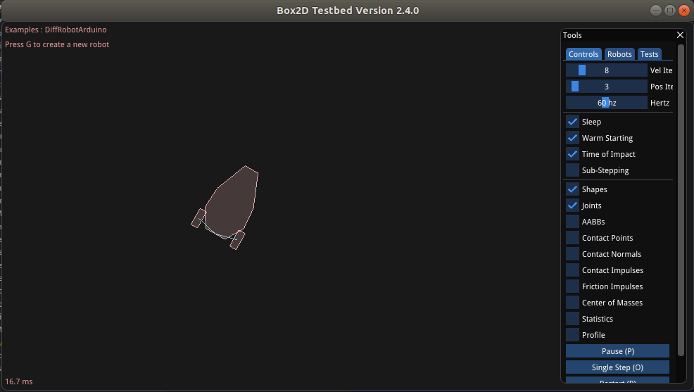

# Mobile Robot simulator

This is C++ project that merges the functionality from a physics engine ([box2d](https://box2d.org/documentation/)) and avr simulator ([simavr](https://github.com/buserror/simavr)) to create high fidelity simulations of mobile robots. Keep in mind that this is currently a lot of work in progress.



## Dependencies

### Simavr

- gcc
- make
- gcc-avr
- avr-libc

### Box2d

- CMake
- libglu-dev
- libxi-dev

### Core

- [arduino cli](https://github.com/arduino/arduino-cli)

## Installation

- run build.sh from a bash shell

## How to use

- Run executable

```bash
cd build
./RoboSandboxProject
```

- Select Example under Tests tab
- Press g button to create a new robot.

- You can find and modify robot firmware inside tesbed/tests
